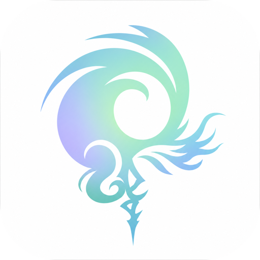
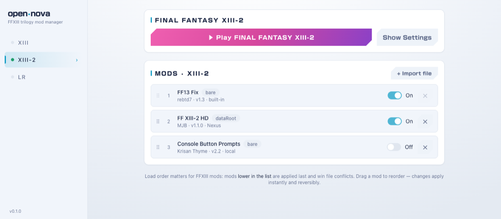

  

# open-nova

A simple, open-source mod manager for the **FINAL FANTASY XIII trilogy** (XIII,
XIII-2, Lightning Returns) on **Steam Deck and Linux**.

> [!WARNING]
> Disclaimer - This tool was vibe coded to let me easily load FF13 mods on Steam Deck. It has only currently been tested with 13-2.

  

## Install

1. Download the latest **`open-nova.AppImage`** from the
   [Releases](../../releases) page.
2. Put it somewhere handy (e.g. your Desktop) and make it executable:
   right-click → *Properties → Permissions → Allow executing*, or run
   `chmod +x open-nova.AppImage` in a terminal.
3. Double-click it to launch.

> You need to own the games on Steam — open-nova finds your installs
> automatically.

## Using it

1. **Pick a game** in the sidebar.
2. **Unpack it once.** open-nova extracts the game's archives so mods can be
   applied and removed cleanly. It's a one-time step per game.
3. **Add mods** with **+ Import file** (`.zip`, `.7z`, `.rar`, or `.ncmp`).
4. **Enable or disable** each mod with its toggle, and **drag to reorder** —
   mods lower in the list win conflicts. Changes apply instantly and are fully
   reversible.
5. Hit **Play**.

A built-in **FF13 Fix** (removes the frame-pacing stutter and forces 16×
anisotropic texture filtering) is bundled for XIII and XIII-2 and enabled by
default. You can turn it off in the mod list like any other mod.

## License

GPL-3.0-or-later. open-nova is an interoperability project for game modding: it
ships none of the original tools' code or any game assets, and requires you to
own the games. See [`CREDITS.md`](CREDITS.md) for attributions.
